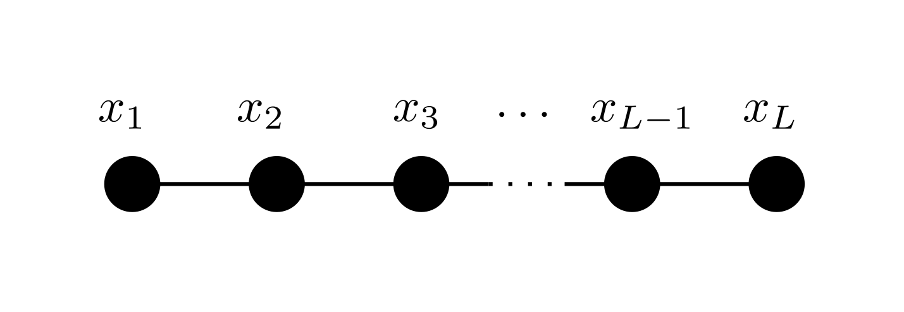

# ChainModels

[](https://stecrotti.github.io/ChainModels.jl/dev)
[](https://stecrotti.github.io/ChainModels.jl/stable)
[](https://github.com/stecrotti/ChainModels.jl/actions/workflows/CI.yml?query=branch%3Amain)
[](https://codecov.io/gh/stecrotti/ChainModels.jl)

This package provides utilities to deal with multivariate functions factorized over a one-dimensional chain, i.e. where each variable $x_i$ interacts only with $x_{i-1}$ and $x_{i+1}$
```math
f(x_1,\ldots,x_L) = e^{f_1(x_1,x_2)} e^{f_2(x_2,x_3)} \cdots e^{f_{L-1}(x_{L-1},x_L)} = \prod_{i=1}^{L-1} e^{f_i(x_i,x_{i+1})}
```
where $x_i \in \mathcal{X}_i=\\{1,2,\ldots,q_i\\}$ and $f_i : \mathcal{X}\_i \times \mathcal{X}\_{i+1} \to \mathbb{R}$.
Once properly normalized, these give probability distributions
```math
p(x_1,\ldots,x_L) = \frac1Z\prod_{i=1}^{L-1} e^{f_i(x_i,x_{i+1})} 
```
with $Z = \sum\limits_{x_1,\ldots,x_L}\prod\limits_{i=1}^{L-1} e^{f_i(x_i,x_{i+1})}$ the normalization constant.

In other words, a probability distribution is a chain model if its [factor graph](https://en.wikipedia.org/wiki/Factor_graph) is a [simple path](https://en.wikipedia.org/wiki/Path_(graph_theory)#simple_path):



## Provided functionalities
For a chain of length $L$ with variables taking one of $q$ values, the following can be performed efficiently:

| Operation | Cost          |
| ------------- | ----------- |
| Compute normalization $Z$      |  $\mathcal O (Lq^2)$ |
| Compute marginals $p(x_i)$     |  $\mathcal O (Lq^2)$ |
| Compute neighbor marginals $p(x_i,x\_{i+1})$     |  $\mathcal O (Lq^2)$ |
| Compute pair marginals $p(x_i,x_j)$     |  $\mathcal O (L^2q^2)$ |
| Draw a sample from $p$     |  $\mathcal O (Lq^2)$ |
| Compute the entropy $S[p]=-\sum_xp(x)\log p(x) $     |  $\mathcal O (Lq^2)$ |

## Quickstart

Install with

```julia
import Pkg; Pkg.add("https://github.com/stecrotti/ChainModels.jl.git")
```

Create a `ChainModel` and compute some stuff

```julia
using ChainModels

L = 100
q = fill(20, L)
f = [randn(q[i], q[i+1]) for i in 1:L-1]
p = ChainModel(f)

Z = normalization(p)
marg = marginals(p)
neigmarg = neighbor_marginals(p)
pairmarg = pair_marginals(p)
S = entropy(p)
x = rand(p, 500)
l = loglikelihood(p, x)
```

## Examples of chain models
- [Markov Chains](https://en.wikipedia.org/wiki/Markov_chain)
- [One-dimensional Ising models](https://en.wikipedia.org/wiki/Ising_model#One_dimension)

## Efficient operations
The efficiency of the operations mentioned above relies on some strategic pre-computations. For example, partial normalizations from the left and from the right ($l$ and $r$, respectively)
```math
\begin{eqnarray}
l_{i}(x_{i+1}) =& \log\sum\limits_{x_1,\ldots,x_i}\prod\limits_{j=1}^i e^{f_j(x_j,x_{j+1})}\\
r_{i}(x_{i-1}) =& \log\sum\limits_{x_i,\ldots,x_L}\prod\limits_{j=i-1}^{L-1} e^{f_j(x_j,x_{j+1})}
\end{eqnarray}
```
can be used to compute normalization, single-variable and nearest-neighbor marginals
```math
\begin{eqnarray}
Z =& \sum\limits_{x_i} e^{l_{i-1}(x_i)+r_{i+1}(x_i)}\quad\forall i\\
p(x_i) =& \frac1Z e^{l_{i-1}(x_i)+r_{i+1}(x_i)}\\
p(x_i,x_{i+1}) =& \frac1Z e^{l_{i-1}(x_i) + f_i(x_i,x_{i+1}) + r_{i+2}(x_{i+1})}\\
\end{eqnarray}
```

## Notes
- The exponential parametrization is favorable because it puts no constraint on the values taken by the $f_i$'s, which can be positive or negative. One might as well parametrize directly as $f(x)=\prod\limits_{i=1}^{L-1} g_i(x_i,x_{i+1})$ with $g_i(x_i,x_{i+1})=e^{f_i(x_i,x_{i+1})}$, but must always ensure $g_i \ge 0$.

## K-Chain Models
This package supports a more general type of Chain Models where interactions involve not just two neighboring variables but a general number $K$. The distribution in this case reads
```math
p(x_1,\ldots,x_L) = \frac1Z\prod_{i=1}^{L-K+1} e^{f_i(x_i,x_{i+1}, \ldots, x_{i+K-1})} 
```

A K-Chain Model can be constructed as
```julia
chain = KChainModel(fK)
```
where `fK` is a vector of length $L-K+1$ whose i-th element is an array of size $q_i, q_{i+1}, \ldots, q_{i+K-1}$.

Special constructors are provided for the special cases $K=1$, where the chain reduces to a fully factorized model where each variable is independent of the others
```julia
chain = FactorizedModel(f1)
```
and $K=2$, as shown above
```julia
chain = ChainModel(f2)
```